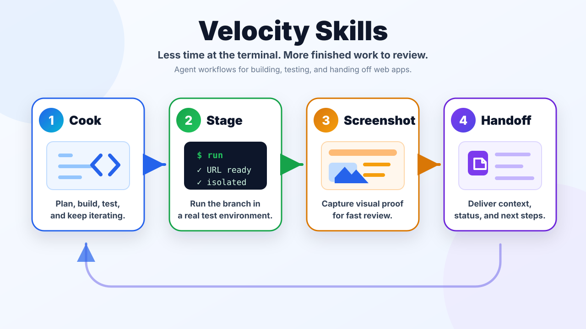
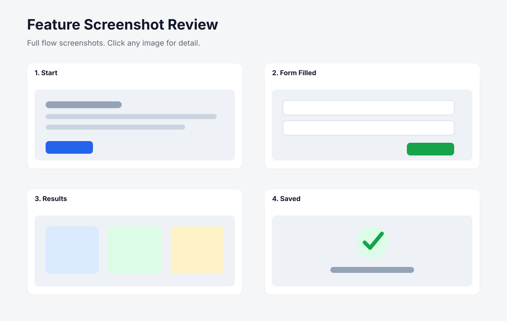

# Velocity Skills

**Less time at the terminal. More finished work to review.**

Reusable workflows that help coding agents build, run, review, and hand off web app work.



AI coding agents are powerful, but they still tend to stop too early: after the first patch, before the work has been tested in a real web app, reviewed in its final form, and packaged so someone else can pick it up.

Velocity Skills gives agents a simple delivery loop:

```text
cook -> stage -> screenshot -> handoff
```

The goal is not to replace developer judgment. The goal is to keep more of the implementation, staging, browser testing, review packaging, and handoff loop inside the agent, so you spend less time at the terminal and less time clicking through browser flows yourself.

## What You Get

- **Longer runs:** agents plan the work, build in slices, test, fix failures, and keep going.
- **Less context switching:** agents can run the app, check the browser, gather evidence, and package results.
- **Real web app verification:** agents stage branches, worktrees, local servers, containers, or cloud sandboxes for browser testing.
- **Contact sheets for review:** agents turn UI flows into clickable screenshot contact sheets, so reviewers do less manual clicking.
- **Cleaner handoffs:** agents summarize status, decisions, verification, risks, links, artifacts, and next steps.

## Install

Install all skills into both common local skill folders:

```bash
curl -fsSL https://raw.githubusercontent.com/giltotherescue/velocity-agent-skills/main/install.sh | sh
```

This installs:

```text
~/.agents/skills/vl-cook/
~/.agents/skills/vl-stage/
~/.agents/skills/vl-screenshot/
~/.agents/skills/vl-handoff/

~/.claude/skills/vl-cook/
~/.claude/skills/vl-stage/
~/.claude/skills/vl-screenshot/
~/.claude/skills/vl-handoff/
```

## Included Workflows

### `/vl-cook`

Tell the agent to own the development loop.

`/vl-cook` tells the agent to understand the repo, split the request into implementation slices, build every required slice, run the right checks, verify browser-facing work when relevant, review its own diff, and hand off clearly.

Good prompts:

```text
/vl-cook Build this feature end-to-end and keep iterating until it is ready for review.
```

```text
/vl-cook Fix this bug, add coverage, and keep going until the failing flow works.
```

### `/vl-stage`

Give the work a real place to run.

`/vl-stage` helps the agent stage a branch, worktree, cloud-agent sandbox, or project so browser-facing work can be tested like a user. It can use a git worktree, a framework dev server, Docker Compose, Python app server, PHP local tooling, or other project-specific runtime depending on the project. The goal is not one specific tool; the goal is a stable environment for real web app verification.

Typical outcomes:

```text
http://localhost:5173
http://feature-name.test
http://127.0.0.1:8000
```

### `/vl-screenshot`

Turn UI work into a review packet the team can scan quickly.

`/vl-screenshot` adds a convenience layer most coding agents do not create by default: a review folder with numbered screenshots, a clickable `index.html` contact sheet, and a downloadable `screenshots.zip`. The contact sheet shows the finished flow at a glance in a two-column desktop grid and includes an in-page previous/next viewer for closer review.

Example output:

```text
~/Desktop/checkout-flow-screenshots/
├── 01-start.png
├── 02-empty-state.png
├── 03-results.png
├── screenshots.zip
└── index.html
```



### `/vl-handoff`

Package the current state for the next person or agent.

`/vl-handoff` gathers current status, decisions, changed files, verification, artifacts, risks, and next steps, then shapes the handoff for the recipient and medium: Slack, GitHub, issue tracker, docs, non-technical review, or agent continuation.

Good prompts:

```text
/vl-handoff Brief the next agent on this worktree.
```

```text
/vl-handoff Write a Slack message asking the frontend team to review the finished project using the contact sheet.
```

## The Loop

You can use each skill independently, but they are designed as an autonomous delivery loop:

```text
/vl-cook -> /vl-stage -> browser testing -> /vl-screenshot -> /vl-handoff
```

- Start with `/vl-cook` when you want the agent to own the development loop.
- Add `/vl-stage` when the branch needs an isolated app URL or runtime.
- Finish browser-facing work with `/vl-screenshot` when teammates should review the experience visually.
- Use `/vl-handoff` when another person, team, or agent needs enough context to continue without archaeology.

## Works With Your Agent Stack

Velocity is designed to sit alongside broader agent frameworks, not replace them.

Use Superpowers, Compound Engineering, Claude Code skills, Codex, Cursor rules, Cline/Roo Code, OpenCode, Aider, or your own `AGENTS.md` workflows to make agents better at planning, coding, debugging, and review. Use Velocity when the work needs to be run, checked in a browser, packaged into a contact sheet, and handed off cleanly.

In tools that do not read skill folders directly, you can still adapt the workflows into `AGENTS.md`, Cursor rules, or project-specific agent instructions.

## Example Prompts

Build the feature, verify it, create review artifacts, and hand off anything the next reviewer needs to know:

```text
/vl-cook Finish the dashboard filters and get them ready for review.
```

Give a branch or worktree a real URL so the agent can test it like a user:

```text
/vl-stage Set up this worktree so it has a real test URL.
```

Create a clickable contact sheet so reviewers can scan the whole UI flow quickly:

```text
/vl-screenshot Capture the onboarding flow for team review.
```

Ask a team to review the finished UI through the contact sheet, with status and next steps included:

```text
/vl-handoff Write a Slack message asking the team to review the contact sheet.
```

## Manual Contact Sheet

If you already have screenshots, run the helper directly:

```bash
python3 ~/.agents/skills/vl-screenshot/scripts/build_contact_sheet.py \
  ~/Desktop/my-feature-screenshots \
  --title "My Feature Review" \
  --subtitle "Click any screenshot for detail." \
  --open
```

## Requirements

- `curl` for the installer.
- `python3` for `/vl-screenshot`.
- A skill-compatible agent that reads local skill folders such as `~/.agents/skills` or `~/.claude/skills`.
- Project-specific tools for staging and testing, such as Node, Python, Docker, PHP, local framework servers, or framework CLIs as needed by the target app.

## Author

Created by Gil Hildebrand.

- Website: [gilhildebrand.com](https://gilhildebrand.com)
- X: [@gilhildebrand](https://x.com/gilhildebrand)

## License

MIT
